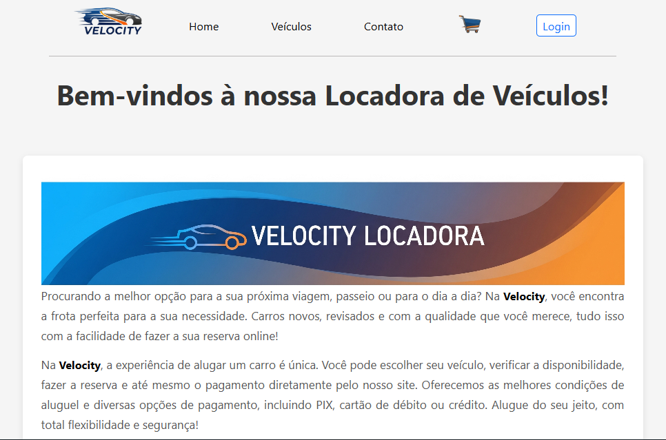

# 🚗 Car Rental Website

## 📖 About the Project

**Velocity** is a complete and responsive web platform for a vehicle rental company. The project was developed to offer a fluid and intuitive user experience, allowing customers to search, select, and book cars in a simple and efficient way. The interface was built with a focus on modern design and usability.

## 🖼️ Preview
Here’s a preview of the website:

  

## ✨ Key Features

* **Attractive Homepage:** A landing page featuring a main banner, information about the rental process, and a showcase of featured vehicles.
* **Vehicle Catalog:** A dedicated section to display all available cars for rent with details such as model, brand, price, and specifications.
* **Responsive Design:** The layout seamlessly adapts to different screen sizes (desktops, tablets, and smartphones).
* **Contact Form:** An easy way for users to get in touch for questions or support.

## 🛠️ Technologies Used

This project was built using the following technologies:

* **HTML:** For the semantic structure of the page content.
* **CSS:** For styling, layout, and responsive design (utilizing Flexbox/Grid).
* **JavaScript:** For interactivity, DOM manipulation, and dynamic functionalities.
* **PHP:** For server-side scripting, processing forms, and managing dynamic content.
* **XAMPP:** Used as the local server environment to run PHP and MySQL.

## 👨‍💻 Authors

  <table style="margin: 0 auto;">
    <tr>
      <td><a href="https://github.com/DavidPotentini"> David Potentini</a></td>
      <td><a href="https://github.com/guilhermediniz1"> Guilherme Diniz</a></td>
      <td><a href="https://github.com/kevindepolli"> Kevin Depolli</a></td>
      <td><a href="https://github.com/Layonj300"> Layon Reis</a></td>
    </tr>
  </table>

